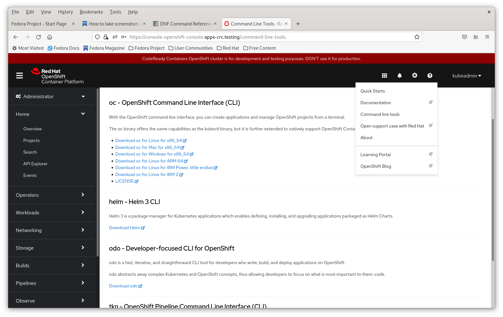
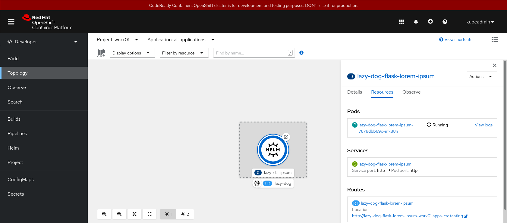

# ** Under Construction **

## **** DO NOT CLONE ****

# Helm: Simple Flask Example

Demonstrates how to use and create a Helm chart using Docker containers.

The example is taken [Build Flask Docker container and deploy to OpenShift](https://github.com/sjfke/ocp-sample-flask-docker)
which is a simple Python Flask web application used which provides static ``Lorem Ipsum`` pages in various styles. 

Various pre-built docker containers are available on [DockerHub](https://hub.docker.com/repository/docker/sjfke/flask-lorem-ipsum), 
and [Quay IO](https://quay.io/repository/sjfke/flask-lorem-ipsum). Notice there are three version
``v0.1.0``, ``v0.2.0`` and ``v0.3.0`` which are identical apart from the version number and a different 
[bootstrap 4 color theme](https://bootstrap.themes.guide/). 

A ``Helm chart`` will be generated for ``v0.1.0`` and then changed to support the other versions to demonstrate 
[helm upgrade](https://helm.sh/docs/helm/helm_upgrade/) and [helm rollback](https://helm.sh/docs/helm/helm_rollback/)

## OpenShift Environment

The deployment was tested using *Red Hat CodeReady Containers* (CRC) details of which can be found here:

* [Introducing Red Hat CodeReady Containers](https://code-ready.github.io/crc/);
* [Red Hat OpenShift 4 on your laptop: Introducing Red Hat CodeReady Containers](https://developers.redhat.com/blog/2019/09/05/red-hat-openshift-4-on-your-laptop-introducing-red-hat-codeready-containers/);
* [Red Hat CodeReady Containers / Install OpenShift on your laptop](https://developers.redhat.com/products/codeready-containers/overview);

A typical CRC cluster session:

```bash
$ crc start                 # start the cluster, go have coffee! this takes awhile
$ crc status                # is the cluster running?
$ crc console --credentials # get login credentials
$ oc login -u kubeadmin -p <password> https://api.crc.testing:6443
$ oc whoami                 # kubeadmin
$ oc project                # current project

$ oc logout                 # logout
$ crc stop                  # shutdown the cluster
```

To obtain the default CRC ``kubeadmin`` password, use the following command.

```bash
$ crc console --credentials
```

## Helm Installation

``Helm`` interacts with your kubernetes cluster, so your cluster needs to be is up and running, and you need to be logged in!

Note: CRC integrates ``Helm Version 3`` so only requires the ``helm`` command line client.

Easiest way to obtain the correct version is directly from the CRC Console WebUI, using ``?`` and select *Command line tools*.



Alternative approaches:
* [Getting started with Helm 3 on OpenShift Container Platform](https://docs.openshift.com/container-platform/4.6/cli_reference/helm_cli/getting-started-with-helm-on-openshift-container-platform.html);
* [Download the latest GitHub helm executable](https://github.com/helm/helm/releases);
* [Follow the Helm Installation guide](https://helm.sh/docs/intro/install/).

Example of downloading, unpacking and installing an archive into ``$HOME/bin``.

```bash
$ curl -L https://mirror.openshift.com/pub/openshift-v4/clients/helm/latest/helm-linux-amd64 -o $HOME/bin/helm
$ chmod +x $HOME/bin/helm
$ helm version
version.BuildInfo{Version:"v3.5.0+6.el8", GitCommit:"77fb4bd2415712e8bfebe943389c404893ad53ce", GitTreeState:"clean", GoVersion:"go1.14.12"}
```

```bash
$ helm repo add stable https://charts.helm.sh/stable # register Artifact Hub (https://artifacthub.io/)

$ helm repo list 
NAME  	URL                          
stable	https://charts.helm.sh/stable

$ helm repo update  # ensure your repo is up to date
Hang tight while we grab the latest from your chart repositories...
...Successfully got an update from the "stable" chart repository
Update Complete. ⎈Happy Helming!⎈

$ helm help      # general help
$ helm repo help # repo command specific help

$ helm completion bash > helm_bash_completion
$ sudo cp helm_bash_completion /etc/bash_completion.d/ # Fedora, (same other Linux distros?)
```

Some useful references:

* [Helm Quickstart Guide](https://v2.helm.sh/docs/using_helm/)
* [Helm Completion](https://helm.sh/docs/helm/helm_completion/)
* [Helm Completion Bash](https://helm.sh/docs/helm/helm_completion_bash/)
* [Helm Documentation](https://v2.helm.sh/docs/)
* [Helm Architecture](https://helm.sh/docs/topics/architecture/)
* [Getting started with Helm 3 on OpenShift Container Platform](https://docs.openshift.com/container-platform/4.6/cli_reference/helm_cli/getting-started-with-helm-on-openshift-container-platform.html)
* [Simple Kubernetes Helm Charts Tutorial with Examples](https://www.golinuxcloud.com/kubernetes-helm-charts/)
* [ArtifactHUB: Public Helm Charts Repository](https://artifacthub.io)

## Helm Chart Creation

This approach is based on [Deploy a Go Application on Kubernetes with Helm](https://docs.bitnami.com/tutorials/deploy-go-application-kubernetes-helm/)

First login to your cluster as ``developer`` (rather than ``kubeadmin``), then:

```bash
$ helm create flask-lorem-ipsum
Creating flask-lorem-ipsum

$ tree flask-lorem-ipsum/
flask-lorem-ipsum/
├── charts
├── Chart.yaml
├── templates
│   ├── deployment.yaml
│   ├── _helpers.tpl
│   ├── hpa.yaml
│   ├── ingress.yaml
│   ├── NOTES.txt
│   ├── serviceaccount.yaml
│   ├── service.yaml
│   └── tests
│       └── test-connection.yaml
└── values.yaml

3 directories, 10 files
```
This creates a helm-chart, a folder/file structure, that is for ``nginx``, version ``1.16.0``, that does not install without modifications.

Chart (folder) structure
* Chart.yaml - chart/application version;
* values.yaml - where to specify parameterized values for templates folder;
* charts folder - deprecated way to specify subsidiary helm charts;
* tests folder - pre/post-deployment tests (rarely used)
* templates folder - series of yaml (applied in a specific order) and helper (go-lang based) scripts

**NOTE:** Helm YAML indentation is ``two white-space characters``! 

Looking at the flask-lorem-ipsum folder.

### File ``Chart.yaml`` with all the default comments removed, and mine added.

```bash
apiVersion: v2                           # helm api version
name: flask-lorem-ipsum                  # chart name (recreate the chart to change this)
description: A Helm chart for Kubernetes # default description
type: application                        # chart type (application or library)
version: 0.1.0                           # chart version (SemVer https://semver.org/)
appVersion: "1.16.0"                     # application version (quoted string, SemVer format optional)
```

### File ``values.yaml`` which provides values to the folder templates, edited to leave only the salient parts and add my comments. 

```bash
replicaCount: 1             # minimum number of pods to run the application

image:                      # how to identify the docker container
  repository: nginx
  pullPolicy: IfNotPresent  # fetch: IfNotPresent, Always, Never
  tag: ""                   # Overrides chart appVersion.

imagePullSecrets: []        # remote repository login credentials
nameOverride: ""
fullnameOverride: ""

serviceAccount:             # account used to run the application
  create: true
  annotations: {}
  name: ""

podAnnotations: {}          # arbitrary key/value pairs, typically used by Prometheus service discovery 

podSecurityContext: {}      # https://cloud.redhat.com/blog/guide-to-kubernetes-security-context-pod-security-policy-psp

securityContext: {}         # https://kubernetes.io/docs/tasks/configure-pod-container/security-context/

service:                    # https://kubernetes.io/docs/concepts/services-networking/connect-applications-service/
  type: ClusterIP           # Internal cluster IP, (alternatives: NodePort, LoadBalancer)
  port: 80                  # Port service listens on (typically 8080)

ingress:                    # Expose service outside the cluster (https://cloud.redhat.com/blog/kubernetes-ingress-vs-openshift-route)
  enabled: false
  className: ""
  annotations: {}
  hosts:
    - host: chart-example.local
      paths:
        - path: /
          pathType: ImplementationSpecific
  tls: []
  
resources: {}

autoscaling:               # When/how to scale the application (add/remove pods)
  enabled: false
  minReplicas: 1
  maxReplicas: 100
  targetCPUUtilizationPercentage: 80
  
nodeSelector: {}

tolerations: []

affinity: {}
```

This chart (set of files and folders) needs to be modified for the *flask-lorem-ipsum* application, namely 
editing the ``Chart.yaml``, ``values.yaml``, ``templates/deployment.yaml`` and ``templates/NOTES.txt`` files.

## Updating the helm chart for the *flask-lorem-ipsum* application

As mentioned earlier ``helm create`` creates a helm chart for ``nginx``, version ``1.16.0``, and so need modification for *flask-lorem-ipsum*.

### Update Chart.yaml

Summary of changes:
* change ``appVersion: "v0.1.0"``

* **Caution:** The *name* value is hard-coded throughout the template files: 
  * Changing it requires regenerating ``helm create ...`` with the new name;

```bash
    20	# This is the version number of the application being deployed. This version number should be
    21	# incremented each time you make changes to the application. Versions are not expected to
    22	# follow Semantic Versioning. They should reflect the version the application is using.
    23	# It is recommended to use it with quotes.
    24	appVersion: "v0.1.0" # was: "1.16.0"
```
* Update the **appVersion** (*string in quotes*), the default matches an early version of nginx;
  * *appVersion* should be incremented each time application is modified;

### Update values.yaml

Summary of changes:
* add values ``livenessProbePath``, ``readinessProbePath`` and ``containerPort``
* change the repository ``repository: docker.io/sjfke/flask-lorem-ipsum``
* change ``tag: "v0.1.0"`` (overruling Chart.yaml)

**Note:**
  * Helm YAML indentation is ``two white-space characters``! 
  * *repository* and *tag* must match that on [DockerHub](https://hub.docker.com/repository/docker/sjfke/flask-lorem-ipsum) otherwise it will not deploy.

```bash
     1	# Default values for flask-lorem-ipsum.
     2	# This is a YAML-formatted file.
     3	# Declare variables to be passed into your templates.
     4	
     5	livenessProbePath: "/isalive"  # new: line added
     6	readinessProbePath: "/isready" # new: line added
     7	containerPort: 8080            # new: line added
     8	
     9	replicaCount: 1
    10	
    11	image:
    12	  repository: docker.io/sjfke/flask-lorem-ipsum # was: nginx
    13	  pullPolicy: IfNotPresent
    14	  # Overrides the image tag whose default is the chart appVersion.
    15	  tag: "v0.1.0" # was: ""
    16	
    17	imagePullSecrets: []
    18	nameOverride: ""
    19	fullnameOverride: ""
    20	
    21	serviceAccount:
```

### Update templates/deployment.yaml

Change the "deployment.yaml" to use the values added to the "values.yaml" above;

Summary of changes:
* if specified read ``livenessProbePath`` from *values.yaml*, or keep the default;
* if specified read ``readinessProbePath`` from *values.yaml*, or keep the default;
* if specified read ``containerPort`` from *values.yaml*, or keep the default;

```bash
    30	      containers:
    31	        - name: {{ .Chart.Name }}
    32	          securityContext:
    33	            {{- toYaml .Values.securityContext | nindent 12 }}
    34	          image: "{{ .Values.image.repository }}:{{ .Values.image.tag | default .Chart.AppVersion }}"
    35	          imagePullPolicy: {{ .Values.image.pullPolicy }}
    36	          ports:
    37	            - name: http
    38	              containerPort: {{ .Values.containerPort | default 80 }} # was: containerPort: 80
    39	              protocol: TCP
    40	          livenessProbe:
    41	            httpGet:
    42	              path: {{ .Values.livenessProbePath | default "/" }} # was: path: /
    43	              port: http
    44	          readinessProbe:
    45	            httpGet:
    46	              path: {{ .Values.readinessProbePath | default "/" }} # was: path: /
    47	              port: http
    48	          resources:
    49	            {{- toYaml .Values.resources | nindent 12 }}
```

### Update templates/NOTES.txt

The content of this file is displayed if the deployment is successful, but defaults to displaying ``kubectl`` (Kubernetes) and
not ``oc`` (OpenShift Container Platform) commands.

Summary of changes:
* Use ``sed`` to globally replace every ``kubectl`` occurrence with ``oc``;
* Windows: use [select-string](https://docs.microsoft.com/en-us/powershell/module/microsoft.powershell.utility/select-string) instead of ``sed``;

```bash
$ cd flask-lorem-ipsum]
$ mv templates/NOTES.txt templates/NOTES.txt.cln
$ sed 's/kubectl/oc/g' templates/NOTES.txt.cln > templates/NOTES.txt
$ rm templates/NOTES.txt.cln
```

```bash
     1	1. Get the application URL by running these commands:
     2	{{- if .Values.ingress.enabled }}
     3	{{- range $host := .Values.ingress.hosts }}
     4	  {{- range .paths }}
     5	  http{{ if $.Values.ingress.tls }}s{{ end }}://{{ $host.host }}{{ .path }}
     6	  {{- end }}
     7	{{- end }}
     8	{{- else if contains "NodePort" .Values.service.type }}
     9	  export NODE_PORT=$(oc get --namespace {{ .Release.Namespace }} -o jsonpath="{.spec.ports[0].nodePort}" services {{ include "flask-lorem-ipsum.fullname" . }})
    10	  export NODE_IP=$(oc get nodes --namespace {{ .Release.Namespace }} -o jsonpath="{.items[0].status.addresses[0].address}")
    11	  echo http://$NODE_IP:$NODE_PORT
    12	{{- else if contains "LoadBalancer" .Values.service.type }}
    13	     NOTE: It may take a few minutes for the LoadBalancer IP to be available.
    14	           You can watch the status of by running 'oc get --namespace {{ .Release.Namespace }} svc -w {{ include "flask-lorem-ipsum.fullname" . }}'
    15	  export SERVICE_IP=$(oc get svc --namespace {{ .Release.Namespace }} {{ include "flask-lorem-ipsum.fullname" . }} --template "{{"{{ range (index .status.loadBalancer.ingress 0) }}{{.}}{{ end }}"}}")
    16	  echo http://$SERVICE_IP:{{ .Values.service.port }}
    17	{{- else if contains "ClusterIP" .Values.service.type }}
    18	  export POD_NAME=$(oc get pods --namespace {{ .Release.Namespace }} -l "app.kubernetes.io/name={{ include "flask-lorem-ipsum.name" . }},app.kubernetes.io/instance={{ .Release.Name }}" -o jsonpath="{.items[0].metadata.name}")
    19	  export CONTAINER_PORT=$(oc get pod --namespace {{ .Release.Namespace }} $POD_NAME -o jsonpath="{.spec.containers[0].ports[0].containerPort}")
    20	  echo "Visit http://127.0.0.1:8080 to use your application"
    21	  oc --namespace {{ .Release.Namespace }} port-forward $POD_NAME 8080:$CONTAINER_PORT
    22	{{- end }}
```

# Test and Deploy the Helm Chart

```bash
$ ls -l
total 4
drwxr-xr-x 4 sjfke sjfke 4096 Dec 30 10:17 flask-lorem-ipsum

$ podman login docker.io # login to docker.io to access containers 
$ oc login -u developer -p developer https://api.crc.testing:6443
$ oc whoami  # developer
$ oc new-project work01

$ helm list # should be empty (as shown)
NAME	NAMESPACE	REVISION	UPDATED	STATUS	CHART	APP VERSION
$ helm lint flask-lorem-ipsum

$ helm lint flask-lorem-ipsum                                # lint the helm chart
$ helm install --dry-run --debug lazy-dog flask-lorem-ipsum  # error-free dry-run with debugging

# install using the helm-chart
$ helm install lazy-dog flask-lorem-ipsum
NAME: lazy-dog
LAST DEPLOYED: Thu Dec 30 10:39:26 2021
NAMESPACE: work01
STATUS: deployed
REVISION: 1
NOTES:
1. Get the application URL by running these commands:
  export POD_NAME=$(oc get pods --namespace work01 -l "app.kubernetes.io/name=flask-lorem-ipsum,app.kubernetes.io/instance=lazy-dog" -o jsonpath="{.items[0].metadata.name}")
  export CONTAINER_PORT=$(oc get pod --namespace work01 $POD_NAME -o jsonpath="{.spec.containers[0].ports[0].containerPort}")
  echo "Visit http://127.0.0.1:8080 to use your application"
  oc --namespace work01 port-forward $POD_NAME 8080:$CONTAINER_PORT


$ oc status
In project work01 on server https://api.crc.testing:6443

svc/lazy-dog-flask-lorem-ipsum - 10.217.4.249:80 -> http
  deployment/lazy-dog-flask-lorem-ipsum deploys docker.io/sjfke/flask-lorem-ipsum:v0.1.0
    deployment #1 running for 2 minutes - 1 pod

View details with 'oc describe <resource>/<name>' or list resources with 'oc get all'.

$ helm list
NAME    	NAMESPACE	REVISION	UPDATED                             	STATUS  	CHART                  	APP VERSION
lazy-dog	work01   	1       	2021-12-30 10:39:26.117738 +0100 CET	deployed	flask-lorem-ipsum-0.1.0	v0.1.0     

$ helm get manifest lazy-dog                                 # check the manifest, expanded install scripts

$ oc get pods # your pod name will be different (READY 1/1 so up and running)
NAME                                          READY   STATUS    RESTARTS   AGE
lazy-dog-flask-lorem-ipsum-7878dbb69c-mk88n   1/1     Running   0          14m

$ oc get all
NAME                                              READY   STATUS    RESTARTS   AGE
pod/lazy-dog-flask-lorem-ipsum-57c9874fb5-clbfj   1/1     Running   0          2m16s

NAME                                 TYPE        CLUSTER-IP     EXTERNAL-IP   PORT(S)   AGE
service/lazy-dog-flask-lorem-ipsum   ClusterIP   10.217.4.218   <none>        80/TCP    2m16s

NAME                                         READY   UP-TO-DATE   AVAILABLE   AGE
deployment.apps/lazy-dog-flask-lorem-ipsum   1/1     1            1           2m16s

NAME                                                    DESIRED   CURRENT   READY   AGE
replicaset.apps/lazy-dog-flask-lorem-ipsum-57c9874fb5   1         1         1       2m16s

$ oc expose service/lazy-dog-flask-lorem-ipsum # expose to make accessible (will be fixed later)
route.route.openshift.io/lazy-dog-flask-lorem-ipsum exposed

$ oc get routes
NAME                         HOST/PORT                                            PATH   SERVICES                     PORT   TERMINATION   WILDCARD
lazy-dog-flask-lorem-ipsum   lazy-dog-flask-lorem-ipsum-work01.apps-crc.testing          lazy-dog-flask-lorem-ipsum   http                 None

# URL: http://<service-name>-<project-name>.apps-crc.testing/ # see HOST/PORT column in 'oc get routes'
$ firefox http://lazy-dog-flask-lorem-ipsum-work01.apps-crc.testing

# checking and accessing the pod (note: your pod name will be different)
$ oc get pod lazy-dog-flask-lorem-ipsum-7878dbb69c-mk88n
$ oc logs lazy-dog-flask-lorem-ipsum-7878dbb69c-mk88n
$ oc describe pod lazy-dog-flask-lorem-ipsum-7878dbb69c-mk88n
$ oc rsh lazy-dog-flask-lorem-ipsum-7878dbb69c-mk88n
```



### Uninstall

```bash
$ helm list
NAME    	NAMESPACE	REVISION	UPDATED                             	STATUS  	CHART                  	APP VERSION
lazy-dog	work01   	1       	2021-12-30 10:39:26.117738 +0100 CET	deployed	flask-lorem-ipsum-0.1.0	v0.1.0     
$ helm uninstall lazy-dog
release "lazy-dog" uninstalled
$ helm list -all
NAME	NAMESPACE	REVISION	UPDATED	STATUS	CHART	APP VERSION

# Route not in helm chart, so have to manually delete it.
$ oc get all
NAME                                                  HOST/PORT                                            PATH   SERVICES                     PORT   TERMINATION   WILDCARD
route.route.openshift.io/lazy-dog-flask-lorem-ipsum   lazy-dog-flask-lorem-ipsum-work01.apps-crc.testing          lazy-dog-flask-lorem-ipsum   http                 None

$ oc delete route.route.openshift.io/lazy-dog-flask-lorem-ipsum
route.route.openshift.io "lazy-dog-flask-lorem-ipsum" deleted
```

### Adding a route to expose flask-lorem-ipsum

Exposing the application outside the CRC cluster has to be done manually using the command:
* ``oc expose service/lazy-dog-flask-lorem-ipsum``

The ``oc expose service`` command is creating a `oc route` to the `lazy-dog-flask-lorem-ipsum` service, 
which is accessible via `lazy-dog-flask-lorem-ipsum-work01.apps-crc.testing` URL.

From looking at the ``oc get routes -o yaml`` output it is possible to find the information required to 
create a ``route.yaml`` file to have ``helm`` do this, that is the `metadata.name` and `spec` section.

```bash
$ oc get routes -o yaml
apiVersion: v1
items:
- apiVersion: route.openshift.io/v1
  kind: Route
  metadata:
    annotations:
      openshift.io/host.generated: "true"
    creationTimestamp: "2022-06-18T17:04:54Z"
    labels:
      app.kubernetes.io/instance: lazy-dog
      app.kubernetes.io/managed-by: Helm
      app.kubernetes.io/name: flask-lorem-ipsum
      app.kubernetes.io/version: v0.1.0
      helm.sh/chart: flask-lorem-ipsum-0.1.0
    name: lazy-dog-flask-lorem-ipsum
    namespace: work01
    resourceVersion: "96932"
    uid: 9f958112-1b9d-4330-adfd-adce5fb22ff7
  spec:
    host: lazy-dog-flask-lorem-ipsum-work01.apps-crc.testing
    port:
      targetPort: http
    to:
      kind: Service
      name: lazy-dog-flask-lorem-ipsum
      weight: 100
    wildcardPolicy: None
  status:
    ingress:
    - conditions:
      - lastTransitionTime: "2022-06-18T17:04:54Z"
        status: "True"
        type: Admitted
      host: lazy-dog-flask-lorem-ipsum-work01.apps-crc.testing
      routerCanonicalHostname: router-default.apps-crc.testing
      routerName: default
      wildcardPolicy: None
kind: List
metadata:
  resourceVersion: ""
  selfLink: ""
```
The `route.yaml` is as follows, notice the `host` URL has been simplified. 

```bash
apiVersion: route.openshift.io/v1
kind: Route
metadata:
  name: {{ include "flask-lorem-ipsum.fullname" . }}
  labels:
    {{- include "flask-lorem-ipsum.labels" . | nindent 4 }}
spec:
  host: flask-lorem-ipsum.apps-crc.testing
  port:
    targetPort: http
  to:
    kind: Service
    name: {{ include "flask-lorem-ipsum.fullname" . }}
    weight: 100
  wildcardPolicy: None
```
Also note the `name` and `labels` are using the helm chart values used in other chart YAML files, 
which are defined in `templates/_helpers.tpl` which is created when the chart was generated.

Add the `route.yaml` file to `templates` folder, redeploy and test.

```bash
$ ls -l
total 4
drwxr-xr-x 4 sjfke sjfke 4096 Dec 30 10:17 flask-lorem-ipsum

$ podman login docker.io # login to docker.io to access containers 

$ oc login -u developer -p developer https://api.crc.testing:6443
$ oc whoami  # developer
$ oc new-project work01

$ helm list # should be empty (as shown)
NAME	NAMESPACE	REVISION	UPDATED	STATUS	CHART	APP VERSION

$ helm lint flask-lorem-ipsum                                # lint the helm chart
$ helm install --dry-run --debug lazy-dog flask-lorem-ipsum  # error-free dry-run with debugging

# install using the helm-chart
$ helm install lazy-dog flask-lorem-ipsum

$ oc get routes # route added by helm with different host URL
NAME                         HOST/PORT                            PATH   SERVICES                     PORT   TERMINATION   WILDCARD
lazy-dog-flask-lorem-ipsum   flask-lorem-ipsum.apps-crc.testing          lazy-dog-flask-lorem-ipsum   http                 None
$ oc get services
NAME                         TYPE        CLUSTER-IP    EXTERNAL-IP   PORT(S)   AGE
lazy-dog-flask-lorem-ipsum   ClusterIP   10.217.4.45   <none>        80/TCP    80m

$ firefox http://flask-lorem-ipsum.apps-crc.testing/

# Now helm uninstall
$ helm list
NAME    	NAMESPACE	REVISION	UPDATED                                	STATUS  	CHART                  	APP VERSION
lazy-dog	work01   	1       	2022-06-21 18:27:56.91539426 +0200 CEST	deployed	flask-lorem-ipsum-0.1.0	v0.1.0     
$ helm uninstall lazy-dog
release "lazy-dog" uninstalled
$ helm list
NAME	NAMESPACE	REVISION	UPDATED	STATUS	CHART	APP VERSION
$ oc get routes # route was created by helm so is removed
No resources found in work01 namespace.
```

While this works, moving the `route.host` and `route.port.targetPort` into to the `values.yaml` make things clearer 
and easier to maintain, especially should you want to add HTTPS/TLS support.

```bash
$ cat -n templates/route.yaml 
     1	apiVersion: route.openshift.io/v1
     2	kind: Route
     3	metadata:
     4	  name: {{ include "flask-lorem-ipsum.fullname" . }}
     5	  labels:
     6	    {{- include "flask-lorem-ipsum.labels" . | nindent 4 }}
     7	spec:
     8	  host: {{ .Values.route.host | default "flask-lorem-ipsum.apps-crc.testing" }}
     9	  port:
    10	    targetPort: {{ .Values.route.port.targetPort | default "http" }}
    11	  to:
    12	    kind: Service
    13	    name: {{ include "flask-lorem-ipsum.fullname" . }}
    14	    weight: 100
    15	  wildcardPolicy: None
    16	
```

```bash
$ cat -n values.yaml | head -15
     1	# Default values for flask-lorem-ipsum.
     2	# This is a YAML-formatted file.
     3	# Declare variables to be passed into your templates.
     4	
     5	livenessProbePath: "/isalive"  # new: line added
     6	readinessProbePath: "/isready" # new: line added
     7	containerPort: 8080            # new: line added
     8	
     9	# Expose the route host (URL) and targetPort
    10	route:
    11	  host: flask-lorem-ipsum.apps-crc.testing
    12	  port:
    13	    targetPort: "http"
    14	
    15	replicaCount: 1
```

Redhat OpenShift Container Platform Route documentation.
* [RedHat Openshift route.openshift.io/v1](https://docs.openshift.com/container-platform/4.10/rest_api/network_apis/route-route-openshift-io-v1.html)
* [RedHat Openshift Configuring Routes](https://access.redhat.com/documentation/en-us/openshift_container_platform/4.10/html/networking/configuring-routes)

### Routing traffic into the cluster, different philosophies.

There are several ways to expose a service outside the cluster, and some disagreement in the industry as to the 
best approach. The following is a good starting pint to understand your choices.

* [A Guide to using Routes, Ingress and Gateway APIs in Kubernetes without vendor lock-in](https://cloud.redhat.com/blog/a-guide-to-using-routes-ingress-and-gateway-apis-in-kubernetes-without-vendor-lock-in)

## Using Helm to deploy a different version

Three updates are required:
* update `appVersion` in `Chart.yaml`
* update `image.tag` in `values.yaml` to select a different DockerHub image.
* update `route.host` in `values.yaml` adding version to make the URL unique.

The `Chart.appVersion` identifies which version the chart will install by default. 
If `values.image.tag` is an empty string, then `Chart.appVersion` is used to determine the `image.tag` as well. 

```bash
$ cat -n flask-lorem-ipsum/Chart.yaml | tail -n +15 | head -n 10
    15	# This is the chart version. This version number should be incremented each time you make changes
    16	# to the chart and its templates, including the app version.
    17	# Versions are expected to follow Semantic Versioning (https://semver.org/)
    18	version: 0.1.0
    19	
    20	# This is the version number of the application being deployed. This version number should be
    21	# incremented each time you make changes to the application. Versions are not expected to
    22	# follow Semantic Versioning. They should reflect the version the application is using.
    23	# It is recommended to use it with quotes.
    24	appVersion: "v0.2.0" # previous: "v0.1.0" was: "1.16.0"
```
```bash
$ cat -n flask-lorem-ipsum/values.yaml | tail -n +5 | head -n 20
     5	livenessProbePath: "/isalive"  # new: line added
     6	readinessProbePath: "/isready" # new: line added
     7	containerPort: 8080            # new: line added
     8	
     9	# Expose the route host (URL) and targetPort
    10	route:
    11	  host: flask-lorem-ipsum-v-0-2-0.apps-crc.testing # add -v-0-2-0 suffix
    12	  port:
    13	    targetPort: "http"
    14	
    15	replicaCount: 1
    16	
    17	image:
    18	  repository: docker.io/sjfke/flask-lorem-ipsum # was: nginx
    19	  pullPolicy: IfNotPresent
    20	  # Overrides the image tag whose default is the chart appVersion.
    21	  tag: "v0.2.0" # previous: "v.0.1.0" was: ""
    22	
    23	imagePullSecrets: []
    24	nameOverride: ""
```

### Deploy the v0.2.0 version under a different name:

Notice that "v0.1.0" and "v0.2.0" have the same URL, so it will deploy but only one of the services is accessible 
via the URL.

A better approach is to change `route.yaml` to include the `image.tag` version in the URL if `Values.route.host` 
is not set, by using an *if..then..else..end* statement in the `route.yaml` and the result is forced to be a string by 
using `| quote` syntax.

In this example the `Values.route.host` is commented out, so the `route.yaml` *else* clause is determining the value 
of `host` .

```bash
$ cat -n flask-lorem-ipsum/templates/route.yaml
     1	apiVersion: route.openshift.io/v1
     2	kind: Route
     3	metadata:
     4	  name: {{ include "flask-lorem-ipsum.fullname" . }}
     5	  labels:
     6	    {{- include "flask-lorem-ipsum.labels" . | nindent 4 }}
     7	spec:
     8	  host: {{ if .Values.route.host }}
     9	        {{ .Values.route.host | quote }}
    10	        {{ else }}
    11	        {{ printf "%s-%s.apps-crc.testing" "flask-lorem-ipsum" .Values.image.tag | quote }}
    12	        {{ end }}
    13	  port:
    14	    targetPort: {{ .Values.route.port.targetPort | default "http" }}
    15	  to:
    16	    kind: Service
    17	    name: {{ include "flask-lorem-ipsum.fullname" . }}
    18	    weight: 100
    19	  wildcardPolicy: None
    20
```

```bash
$ cat -n flask-lorem-ipsum/values.yaml | tail -n +5 | head -n 20
     5	livenessProbePath: "/isalive"  # new: line added
     6	readinessProbePath: "/isready" # new: line added
     7	containerPort: 8080            # new: line added
     8	
     9	# Expose the route host (URL) and targetPort
    10	route:
    11	  # host: flask-lorem-ipsum.apps-crc.testing
    12	  port:
    13	    targetPort: "http"
    14	
    15	replicaCount: 1
    16	
    17	image:
    18	  repository: docker.io/sjfke/flask-lorem-ipsum # was: nginx
    19	  pullPolicy: IfNotPresent
    20	  # Overrides the image tag whose default is the chart appVersion.
    21	  tag: "v0.2.0"
    22	
    23	imagePullSecrets: []
    24	nameOverride: ""
```

```bash
$ helm install --dry-run --debug lazy-cat flask-lorem-ipsum
$ helm install lazy-cat flask-lorem-ipsum
$ firefox http://flask-lorem-ipsum-v-0-2-0.apps-crc.testing/
$ helm uninstall lazy-cat
```

## Chart Repositories

### References consulted
* [Helm: The Chart Repository Guide](https://helm.sh/docs/topics/chart_repository/)
* [ChartMuseum - Documentation](https://chartmuseum.com/docs/)
* [ChartMuseum - ArtifactHUB](https://artifacthub.io/packages/helm/chartmuseum/chartmuseum)
* [ChartMuseum - GitHub](https://github.com/helm/chartmuseum)
* [JFrog Container Registry Helm Chart - ArtifactHUB](https://artifacthub.io/packages/helm/jfrog/artifactory-jcr)
* [Kubernetes Helm Chart Repositories - JFROG Artifactory](https://www.jfrog.com/confluence/display/JFROG/Kubernetes+Helm+Chart+Repositories)

### Helm packing with local ChartMuseum repo

This uses ChartMuseum as the local repo, see [Installing Local ChartMuseum from its Helm Chart](#installing-local-chartmuseum-from-its-helm-chart)

```bash
$ ls -l
total 4
drwxr-xr-x 4 sjfke sjfke 4096 Jun 23 15:38 flask-lorem-ipsum

$ helm package flask-lorem-ipsum/
Successfully packaged chart and saved it to: /home/sjfke/sandbox/flask-lorem-ipsum-0.1.0.tgz

$ ls -l
total 8
drwxr-xr-x 4 sjfke sjfke 4096 Jun 23 15:38 flask-lorem-ipsum
-rw-rw-r-- 1 sjfke sjfke 4056 Jun 27 10:07 flask-lorem-ipsum-0.1.0.tgz

To add the *flask-lorem-ipsum* chart to the *my-chartmuseum* repo.
```bash
$ helm repo add my-chartmuseum http://my-chartmuseum-chartmuseum.apps-crc.testing # add new chart repo
$ curl -X POST --data-binary "@flask-lorem-ipsum-0.1.0.tgz" http://my-chartmuseum-chartmuseum.apps-crc.testing/api/charts
$ helm search repo my-chartmuseum
NAME                            	CHART VERSION	APP VERSION	DESCRIPTION                
my-chartmuseum/flask-lorem-ipsum	0.1.0        	v0.1.0     	A Helm chart for Kubernetes
```

To replace the chart with a newer version it needs to removed from *my-chartmuseum* repo.
```bash
$ curl -X DELETE http://my-chartmuseum-chartmuseum.apps-crc.testing/api/charts/flask-lorem-ipsum/0.1.0
$ curl -X POST --data-binary "@flask-lorem-ipsum-0.1.0.tgz" http://my-chartmuseum-chartmuseum.apps-crc.testing/api/charts
$ helm search repo my-chartmuseum
NAME                            	CHART VERSION	APP VERSION	DESCRIPTION                
my-chartmuseum/flask-lorem-ipsum	0.1.0        	v0.1.0     	A Helm chart for Kubernetes
```

To deploy this chart
```bash
$ oc project work1
$ helm repo update # get the latest index of all repos  
$ helm install --dry-run --debug lazy-cat my-chartmuseum/flask-lorem-ipsum
$ helm install lazy-cat my-chartmuseum/flask-lorem-ipsum
```

To provide greater security your chart can be signed using a GPG key, see [GPG keys setup](#gpg-keys-setup), as described in
[Helm Provenance and Integrity - The Workflow](https://helm.sh/docs/topics/provenance/#the-workflow), and the signature
verified during the installation.

```bash
$ gpg1 --list-keys | grep uid
uid                  sjfke (Helm) <gcollis@ymail.com>

$ helm package --debug --sign --key sjfke --keyring ~/.gnupg/secring.gpg flask-lorem-ipsum
Password for key "sjfke (Helm) <gcollis@ymail.com>" >  
Successfully packaged chart and saved it to: /home/gcollis/work06/ocp-sample-flask-helm/sandbox/flask-lorem-ipsum-0.1.0.tgz

# alternative using the complete 'uid'
$ helm package --debug --sign --key 'sjfke (Helm) <gcollis@ymail.com>' --keyring ~/.gnupg/secring.gpg flask-lorem-ipsum
Password for key "sjfke (Helm) <gcollis@ymail.com>" >  
Successfully packaged chart and saved it to: /home/gcollis/work06/ocp-sample-flask-helm/sandbox/flask-lorem-ipsum-0.1.0.tgz

$ ls -l
total 12
drwxr-xr-x 4 sjfke sjfke 4096 Jun 30 21:21 flask-lorem-ipsum
-rw-rw-r-- 1 sjfke sjfke 4056 Jul  1 16:29 flask-lorem-ipsum-0.1.0.tgz
-rw-r--r-- 1 sjfke sjfke  925 Jul  1 16:29 flask-lorem-ipsum-0.1.0.tgz.prov

# Check the signature
$ helm verify flask-lorem-ipsum-0.1.0.tgz
Signed by: sjfke (Helm) <gcollis@ymail.com>
Using Key With Fingerprint: F50B1542D6DD4EB3946995715042BA8D7FA9B776
Chart Hash Verified: sha256:fc6ec3d09a5133fd32a8be6d3f7e5cc7f300c18b5e7d99466fbc37d576da1365

# If necessary delete the previous version of this chart from my-chartmuseum
$ helm repo search my-chartmuseum
$ curl -X DELETE http://my-chartmuseum-chartmuseum.apps-crc.testing/api/charts/flask-lorem-ipsum/0.1.0
{"deleted":true}

# Upload the chart and the providence file.
$ curl -F "chart=@flask-lorem-ipsum-0.1.0.tgz" -F "prov=@flask-lorem-ipsum-0.1.0.tgz.prov" http:///my-chartmuseum-chartmuseum.apps-crc.testing/api/charts
{"saved":true}

$ oc login -u developer -p developer https://api.crc.testing:6443
$ oc whoami # developer
$ oc project work01

# If necessary uninstall lazy-cat
$ helm list
NAME        	NAMESPACE	REVISION	UPDATED                                 	STATUS  	CHART                  	APP VERSION
lazy-cat    	work01   	1       	2022-06-27 16:21:01.566456556 +0200 CEST	deployed	flask-lorem-ipsum-0.1.0	v0.1.0     
$ helm uninstall lazy-cat
release "lazy-cat" uninstalled

$ helm install --verify lazy-cat flask-lorem-ipsum                # local .tgz, .tgz.prov files
$ helm install --verify lazy-cat my-chartmuseum/flask-lorem-ipsum # my-chartmuseum version (.tgz, .tgz.prov)
NAME: lazy-cat
LAST DEPLOYED: Fri Jul  1 16:58:25 2022
NAMESPACE: work01
STATUS: deployed
REVISION: 1
NOTES:
1. Get the application URL by running these commands:
  export POD_NAME=$(oc get pods --namespace work01 -l "app.kubernetes.io/name=flask-lorem-ipsum,app.kubernetes.io/instance=lazy-cat" -o jsonpath="{.items[0].metadata.name}")
  export CONTAINER_PORT=$(oc get pod --namespace work01 $POD_NAME -o jsonpath="{.spec.containers[0].ports[0].containerPort}")
  echo "Visit http://127.0.0.1:8080 to use your application"
  oc --namespace work01 port-forward $POD_NAME 8080:$CONTAINER_PORT

$ helm list
NAME    	NAMESPACE	REVISION	UPDATED                                 	STATUS  	CHART                  	APP VERSION
lazy-cat	work01   	1       	2022-07-01 16:58:25.429944381 +0200 CEST	deployed	flask-lorem-ipsum-0.1.0	v0.1.0     

$ firefox http://flask-lorem-ipsum.apps-crc.testing/
```

#### Helm Upgrade and Rollback

There are 3 versions of [flask-lorem-ipsum on the DockerHub repo](https://hub.docker.com/repository/docker/sjfke/flask-lorem-ipsum)
versions `0.1.0`, `0.2.0` and `0.3.0`which are identical apart from the version number and a different 
[bootstrap 4 color theme](https://bootstrap.themes.guide/).

The `flask-lorem-ipsum` helm chart will be modified for each release and these will be used to illustrate `helm upgrade`
and `helm rollback`. 

Conveniently, the chart name does not change, so the chart does not have to be recreated from scratch
only `Chart.yaml` and `values.yaml` need minor updates. Notice that the `Chart.version`, and the 
`Chart.appVersion` are both updated even though there are no fundamental changes to the Helm chart itself.

```bash
$ cp -R flask-lorem-ipsum flask-lorem-ipsum-v0.2.0
$ cp -R flask-lorem-ipsum flask-lorem-ipsum-v0.3.0

$ diff flask-lorem-ipsum flask-lorem-ipsum-v0.2.0
Common subdirectories: flask-lorem-ipsum/charts and flask-lorem-ipsum-v0.2.0/charts
diff flask-lorem-ipsum/Chart.yaml flask-lorem-ipsum-v0.2.0/Chart.yaml
18c18
< version: 0.1.0
---
> version: 0.2.0
24c24
< appVersion: "v0.1.0" # was: "1.16.0"
---
> appVersion: "v0.2.0" # was: "1.16.0"
Common subdirectories: flask-lorem-ipsum/templates and flask-lorem-ipsum-v0.2.0/templates
diff flask-lorem-ipsum/values.yaml flask-lorem-ipsum-v0.2.0/values.yaml
21c21
<   tag: "v0.1.0" # was: ""
---
>   tag: "v0.2.0" # was: ""

$ diff flask-lorem-ipsum flask-lorem-ipsum-v0.3.0
Common subdirectories: flask-lorem-ipsum/charts and flask-lorem-ipsum-v0.3.0/charts
diff flask-lorem-ipsum/Chart.yaml flask-lorem-ipsum-v0.3.0/Chart.yaml
18c18
< version: 0.1.0
---
> version: 0.3.0
24c24
< appVersion: "v0.1.0" # was: "1.16.0"
---
> appVersion: "v0.3.0" # was: "1.16.0"
Common subdirectories: flask-lorem-ipsum/templates and flask-lorem-ipsum-v0.3.0/templates
diff flask-lorem-ipsum/values.yaml flask-lorem-ipsum-v0.3.0/values.yaml
21c21
<   tag: "v0.1.0" # was: ""
---
>   tag: "v0.3.0" # was: ""
```

To check the modifications (lazy-dog = v0.1.0, lazy-cat = v0.2.0, lazy-bug = v0.3.0)
```bash
$ helm install --dry-run --debug lazy-dog flask-lorem-ipsum
$ helm install lazy-dog flask-lorem-ipsum
$ helm install --dry-run --debug lazy-cat flask-lorem-ipsum-v0.2.0/ 
$ helm install lazy-dog flask-lorem-ipsum 
$ helm install --dry-run --debug lazy-bug flask-lorem-ipsum-v0.3.0/ 
$ helm install lazy-bug flask-lorem-ipsum-v0.3.0/ 

# Note all same revision because 'helm install', not 'helm upgrade' 
$ helm list
NAME    	NAMESPACE	REVISION	UPDATED                                 	STATUS  	CHART                  	APP VERSION
lazy-bug	work01   	1       	2022-07-03 14:00:40.572254818 +0200 CEST	deployed	flask-lorem-ipsum-0.3.0	v0.3.0     
lazy-cat	work01   	1       	2022-07-03 13:57:59.801841343 +0200 CEST	deployed	flask-lorem-ipsum-0.2.0	v0.2.0     
lazy-dog	work01   	1       	2022-07-03 13:57:47.75808608 +0200 CEST 	deployed	flask-lorem-ipsum-0.1.0	v0.1.0     

$ firefox http://flask-lorem-ipsum-v0.1.0.apps-crc.testing/
$ firefox http://flask-lorem-ipsum-v0.2.0.apps-crc.testing/
$ firefox http://flask-lorem-ipsum-v0.3.0.apps-crc.testing/

$ helm uninstall lazy-dog lazy-cat lazy-bug
```

```bash
$ helm install lazy-dog flask-lorem-ipsum 
NAME: lazy-dog
LAST DEPLOYED: Sun Jul  3 15:18:04 2022
NAMESPACE: work01
STATUS: deployed
REVISION: 1
...
$ helm upgrade lazy-dog flask-lorem-ipsum-v0.2.0
Error: UPGRADE FAILED: cannot patch "lazy-dog-flask-lorem-ipsum" with kind Route: Route.route.openshift.io "lazy-dog-flask-lorem-ipsum" is invalid: spec.host: Invalid value: "flask-lorem-ipsum-v0.2.0.apps-crc.testing": field is immutable
```

The easiest way to fix this issue is uncomment the `route.host` line in the `values.yaml` file in all the charts.

```bash
$ cat -n flask-lorem-ipsum/values.yaml | tail -n +8 | head -n 8
     8	
     9	# Expose the route host (URL) and targetPort
    10	route:
    11	  host: flask-lorem-ipsum.apps-crc.testing
    12	  port:
    13	    targetPort: "http"
    14	
    15	replicaCount: 1
    
$ helm install lazy-dog flask-lorem-ipsum
$ helm list
NAME    	NAMESPACE	REVISION	UPDATED                                 	STATUS  	CHART                  	APP VERSION
lazy-dog	work01   	1       	2022-07-03 18:00:10.546182232 +0200 CEST	deployed	flask-lorem-ipsum-0.1.0	v0.1.0     

$ helm upgrade lazy-dog flask-lorem-ipsum-v0.2.0
Release "lazy-dog" has been upgraded. Happy Helming!
$ helm list
NAME    	NAMESPACE	REVISION	UPDATED                                 	STATUS  	CHART                  	APP VERSION
lazy-dog	work01   	2       	2022-07-03 18:00:45.601138471 +0200 CEST	deployed	flask-lorem-ipsum-0.2.0	v0.2.0     

$ helm upgrade lazy-dog flask-lorem-ipsum-v0.3.0
Release "lazy-dog" has been upgraded. Happy Helming!
$ helm list
NAME    	NAMESPACE	REVISION	UPDATED                                 	STATUS  	CHART                  	APP VERSION
lazy-dog	work01   	3       	2022-07-03 18:01:16.552781951 +0200 CEST	deployed	flask-lorem-ipsum-0.3.0	v0.3.0     

$ helm rollback lazy-dog 2
Rollback was a success! Happy Helming!
$ helm list
NAME    	NAMESPACE	REVISION	UPDATED                                 	STATUS  	CHART                  	APP VERSION
lazy-dog	work01   	4       	2022-07-03 18:01:31.139790672 +0200 CEST	deployed	flask-lorem-ipsum-0.2.0	v0.2.0    
```

To avoid updating the `values.route.host ` in all the charts, this can be done via a CLI `--set` or an external YAML file.

Specifying `route.host` on the CLI
```bash
$ helm install --set route.host=flask-lorem-ipsum.apps-crc.testing lazy-dog flask-lorem-ipsum
$ helm list
NAME    	NAMESPACE	REVISION	UPDATED                                	STATUS  	CHART                  	APP VERSION
lazy-dog	work01   	1       	2022-07-03 17:32:44.40361522 +0200 CEST	deployed	flask-lorem-ipsum-0.1.0	v0.1.0     

$ helm upgrade --set route.host=flask-lorem-ipsum.apps-crc.testing lazy-dog flask-lorem-ipsum-v0.2.0
Release "lazy-dog" has been upgraded. Happy Helming!
$ helm list
NAME    	NAMESPACE	REVISION	UPDATED                                 	STATUS  	CHART                  	APP VERSION
lazy-dog	work01   	2       	2022-07-03 17:33:15.638318735 +0200 CEST	deployed	flask-lorem-ipsum-0.2.0	v0.2.0     

$ helm upgrade --set route.host=flask-lorem-ipsum.apps-crc.testing lazy-dog flask-lorem-ipsum-v0.3.0
Release "lazy-dog" has been upgraded. Happy Helming!
$ helm list
NAME    	NAMESPACE	REVISION	UPDATED                                 	STATUS  	CHART                  	APP VERSION
lazy-dog	work01   	3       	2022-07-03 17:33:34.506567411 +0200 CEST	deployed	flask-lorem-ipsum-0.3.0	v0.3.0     

$ helm rollback lazy-dog 2
Rollback was a success! Happy Helming!
$ helm list
NAME    	NAMESPACE	REVISION	UPDATED                                 	STATUS  	CHART                  	APP VERSION
lazy-dog	work01   	4       	2022-07-03 17:34:19.575881478 +0200 CEST	deployed	flask-lorem-ipsum-0.2.0	v0.2.0     
```
Specify the `route.host` in an external YAML file

```bash
$ cat host-route.yaml 
route:
  host: flask-lorem-ipsum.apps-crc.testing

$ helm install lazy-dog -f host-route.yaml flask-lorem-ipsum
Release "lazy-dog" has been upgraded. Happy Helming!
$ helm list
NAME    	NAMESPACE	REVISION	UPDATED                                 	STATUS  	CHART                  	APP VERSION
lazy-dog	work01   	1       	2022-07-03 17:17:45.168481382 +0200 CEST	deployed	flask-lorem-ipsum-0.1.0	v0.1.0     

$ helm upgrade lazy-dog -f host-route.yaml flask-lorem-ipsum-v0.2.0
Release "lazy-dog" has been upgraded. Happy Helming!
$ helm list
NAME    	NAMESPACE	REVISION	UPDATED                                 	STATUS  	CHART                  	APP VERSION
lazy-dog	work01   	2       	2022-07-03 17:18:05.475443732 +0200 CEST	deployed	flask-lorem-ipsum-0.2.0	v0.2.0     
$ helm upgrade lazy-dog -f host-route.yaml flask-lorem-ipsum-v0.3.0
$ helm list
NAME    	NAMESPACE	REVISION	UPDATED                                	STATUS  	CHART                  	APP VERSION
lazy-dog	work01   	3       	2022-07-03 17:18:24.64226263 +0200 CEST	deployed	flask-lorem-ipsum-0.3.0	v0.3.0     

$ helm rollback lazy-dog 1
Rollback was a success! Happy Helming!
$ helm list
NAME    	NAMESPACE	REVISION	UPDATED                                 	STATUS  	CHART                  	APP VERSION
lazy-dog	work01   	4       	2022-07-03 17:18:42.988940372 +0200 CEST	deployed	flask-lorem-ipsum-0.1.0	v0.1.0     
```

### GPG keys setup

* [A valid PGP keypair](https://docs.github.com/en/github/authenticating-to-github/generating-a-new-gpg-key) in a binary (not ASCII-armored) format
* [GnuPG command line tools](https://www.tutorialspoint.com/unix_commands/gpg.htm)
* [Keybase command line tools](https://book.keybase.io/guides/command-line) (optional)

Helm requires *gpg GnuPG version 1*, see 
[Helm Provenance and Integrity - The Workflow](https://helm.sh/docs/topics/provenance/#the-workflow).

The gpg (GnuPG) 1.4.x version, is still available for many platforms, so the older version is installed for checking 
the keys.

```bash
$ gpg --version
gpg (GnuPG) 2.3.4
libgcrypt 1.9.4-unknown
Copyright (C) 2021 Free Software Foundation, Inc.
License GNU GPL-3.0-or-later <https://gnu.org/licenses/gpl.html>
This is free software: you are free to change and redistribute it.
There is NO WARRANTY, to the extent permitted by law.
....

$ sudo dnf install gnupg1.x86_64 # install older version
$ gpg1 --version
gpg (GnuPG) 1.4.23
Copyright (C) 2015 Free Software Foundation, Inc.
License GPLv3+: GNU GPL version 3 or later <http://gnu.org/licenses/gpl.html>
This is free software: you are free to change and redistribute it.
There is NO WARRANTY, to the extent permitted by law.
....

$ gpg --list-secret-keys  # creates everything if the first time
gpg: directory '/home/gcollis/.gnupg' created
gpg: keybox '/home/gcollis/.gnupg/pubring.kbx' created
gpg: /home/gcollis/.gnupg/trustdb.gpg: trustdb created

$ gpg --full-generate-key
gpg (GnuPG) 2.2.25; Copyright (C) 2020 Free Software Foundation, Inc.
This is free software: you are free to change and redistribute it.
There is NO WARRANTY, to the extent permitted by law.

Please select what kind of key you want:
   (1) RSA and RSA (default)
....
# If this fails with: agent_genkey failed: No such file or directory
# Try the following, and repeat the full-generate-key
$ gpgconf --kill gpg-agent # fix gpg: agent_genkey failed: No such file or directory

# From: https://helm.sh/docs/topics/provenance/#the-workflow
# If *GnuPG version 2*, it uses .kbx for key-rings, helm needs the old *GnuPG version 1* format 
$ gpg --export >~/.gnupg/pubring.gpg             # NOTE: no space after the '>'
$ gpg --export-secret-keys >~/.gnupg/secring.gpg # NOTE: no space after the '>'

$ tree ~/.gnupg/ # notice pubring.gpg and secring.gpg are added.
/home/sjfke/.gnupg/
├── openpgp-revocs.d
│   └── 4836FDB95D33CEDF32EB3C757F3DE8A545C0A597.rev
├── private-keys-v1.d
│   ├── 19077755F3C27DC2F7EB6237BEA062265BAABBBC.key
│   └── A8F32B53734AD7C52A8852C53B8D9447BBE1E546.key
├── pubring.gpg
├── pubring.kbx
├── pubring.kbx~
├── secring.gpg
└── trustdb.gpg

# Now check the keys
$ gpg --list-keys         # GnuPG (gpg) V2
$ gpg --list-secret-keys  # GnuPG (gpg) V2
$ gpg1 --list-keys        # GnuPG (gpg) V1
$ gpg1 --list-secret-keys # GnuPG (gpg) V1

# Helm requires the gpg1 uid, which is the found from either command
$ gpg1 --list-keys | grep uid
uid                  sjfke (Helm) <gcollis@ymail.com>
$ gpg1 --list-secret-keys | grep uid
uid                  sjfke (Helm) <gcollis@ymail.com>
```

### Installing Local ChartMuseum from its Helm Chart

```bash
$ oc login -u developer -p developer https://api.crc.testing:6443
$ oc whoami # developer
$ oc new-project chartmuseum
$ helm repo add chartmuseum https://chartmuseum.github.io/charts 
$ helm repo update
$ helm list
NAME          	NAMESPACE  	REVISION	UPDATED                                 	STATUS  	CHART            	APP VERSION
my-chartmuseum	chartmuseum	1       	2022-06-23 17:06:02.710156343 +0200 CEST	deployed	chartmuseum-3.8.0	0.14.0     
$ helm install my-chartmuseum chartmuseum/chartmuseum --version 3.8.0 --set env.open.DISABLE_API=false
```
By default, the chartmuseum helm chart installs with DISABLE_API: true parameter, so, any request to `/api` does not work, (returns 404).
So in the helm install it is `set DISABLE_API=false` on the command line.

With a default CRC configuration the installation fails, with an error message like:

```bash
Error creating: pods "my-chartmuseum-6f56f884d-" is forbidden: 
unable to validate against any security context constraint: [provider "anyuid": 
Forbidden: not usable by user or serviceaccount, provider restricted: .spec.securityContext.fsGroup: Invalid value: []int64{1000}: 1000 is not an allowed group, provider "nonroot": 
Forbidden: not usable by user or serviceaccount, provider "hostmount-anyuid": 
Forbidden: not usable by user or serviceaccount, provider "machine-api-termination-handler": 
Forbidden: not usable by user or serviceaccount, provider "hostnetwork": 
Forbidden: not usable by user or serviceaccount, provider "hostaccess": 
Forbidden: not usable by user or serviceaccount, provider "privileged": 
Forbidden: not usable by user or serviceaccount]
```

A simple resolution is as follows, but **warning** This allows images to run as the root UID if no USER is specified in the Dockerfile.
* [Enable Images to Run with USER in the Dockerfile](https://docs.openshift.com/container-platform/3.11/admin_guide/manage_scc.html)

```bash
# running the following as kubadmin, allows the install to proceed. 
$ oc login -u kubeadmin -p $PASSWORD https://api.crc.testing:6443
$ oc adm policy add-scc-to-group anyuid system:authenticated
clusterrole.rbac.authorization.k8s.io/system:openshift:scc:anyuid added: "system:authenticated"
$ oc logout

# Resetting CRC defaults:
$ oc login -u kubeadmin -p $PASSWORD https://api.crc.testing:6443
$ oc adm policy remove-scc-from-group anyuid system:authenticated
clusterrole.rbac.authorization.k8s.io/system:openshift:scc:anyuid removed: "system:authenticated"
$ oc logout
```
Once policy change is applied the helm installation will complete, but notice it does not expose the service, so this
needs to be done manually.

```bash
$ oc expose service/my-chartmuseum
$ firefox http://my-chartmuseum-chartmuseum.apps-crc.testing
```

To add the *flask-lorem-ipsum* chart to the *my-chartmuseum* repo.
```bash
$ helm repo add my-chartmuseum http://my-chartmuseum-chartmuseum.apps-crc.testing # add new chart repo
$ helm package flask-lorem-ipsum/
$ curl -X POST --data-binary "@flask-lorem-ipsum-0.1.0.tgz" http://my-chartmuseum-chartmuseum.apps-crc.testing/api/charts

$ oc project work1
$ helm repo update # get the latest index of all repos  
$ helm install --dry-run --debug lazy-cat my-chartmuseum/flask-lorem-ipsum
$ helm install lazy-cat my-chartmuseum/flask-lorem-ipsum
$ helm list
$ firefox http://flask-lorem-ipsum.apps-crc.testing/

$ helm uninstall lazy-cat 
```

To remove the *flask-lorem-ipsum* chart to the *my-chartmuseum* repo.
```bash
$ curl -X DELETE http://my-chartmuseum-chartmuseum.apps-crc.testing/api/charts/flask-lorem-ipsum/0.1.0
```

By default, chartmuseum uses filesystem storage within the pod (directory /storage), so the contents are lost 
if the pod is recreated. To overcome chartmuseum needs persistent storage which can be or configured to use `local file storage`, `etcd` or one of the supported `cloud storage solutions` 
(Amazon S3, MinIO, DigitalOcean, Google Cloud Storage, Microsoft Azure Blob Storage...).

### Installing Local JFrog Artifactory from its Helm Chart

*** TODO - fix the physical volume claims issue ***

```bash
$ oc whoami # kubeadmin
$ oc new-project artifactory-jcr
$ helm repo add jfrog https://charts.jfrog.io
$ helm repo update
$ helm upgrade --install jfrog-container-registry --set artifactory.postgresql.postgresqlPassword=<postgres_password> --namespace artifactory-jcr jfrog/artifactory-jcr
$ helm upgrade --install jfrog-container-registry --set artifactory.postgresql.postgresqlPassword='P0stGre$' --namespace artifactory-jcr jfrog/artifactory-jcr
Release "jfrog-container-registry" does not exist. Installing it now.
NAME: jfrog-container-registry
LAST DEPLOYED: Thu Jun 23 17:33:55 2022
NAMESPACE: artifactory-jcr
STATUS: deployed
REVISION: 1
TEST SUITE: None
NOTES:
Congratulations. You have just deployed JFrog Container Registry!
```
